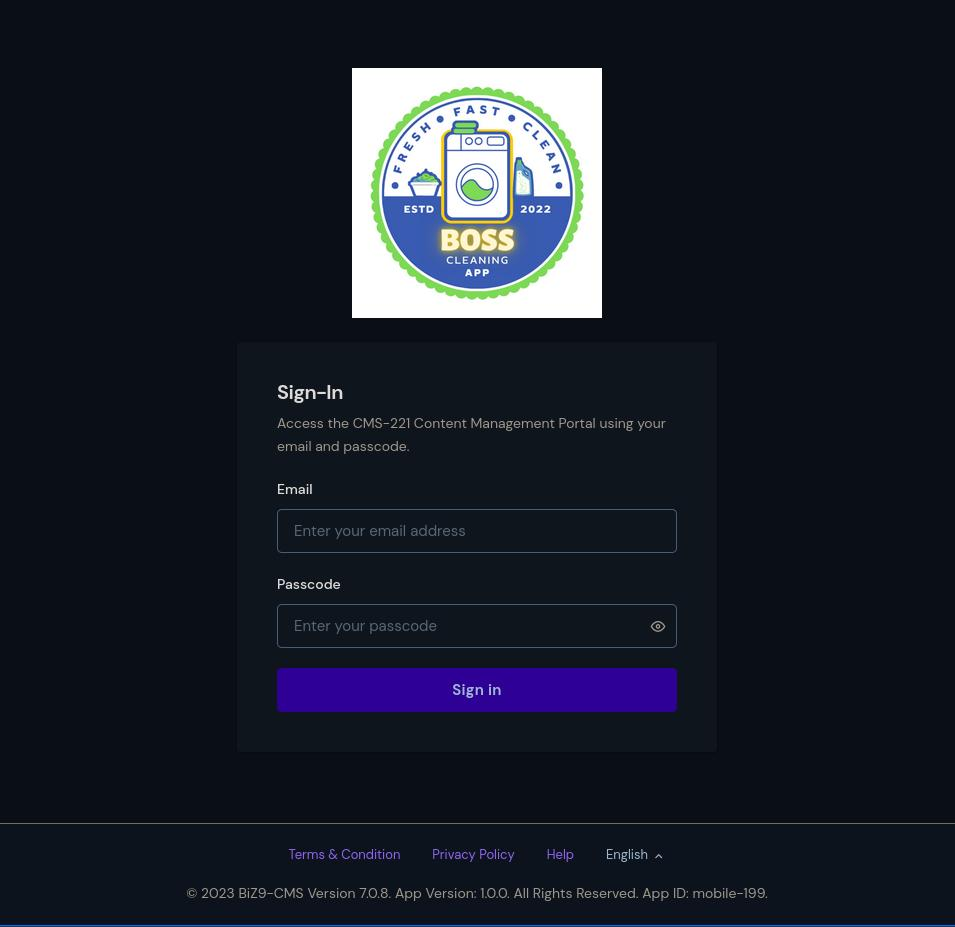
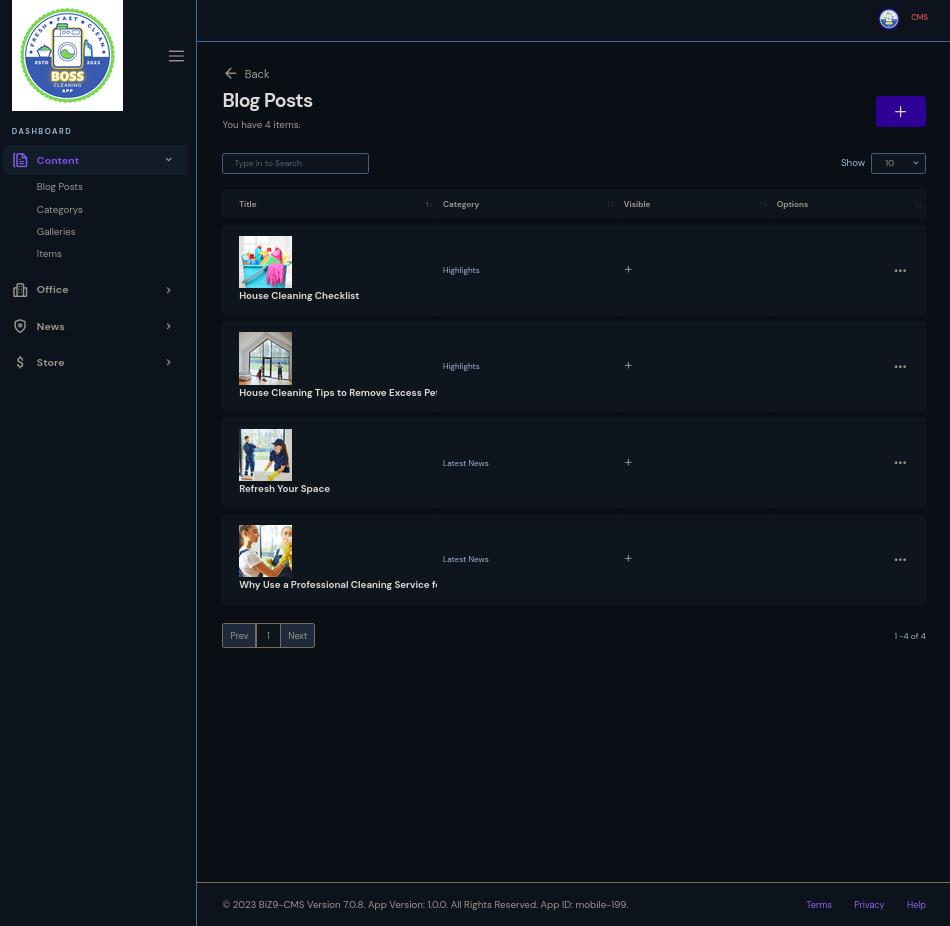
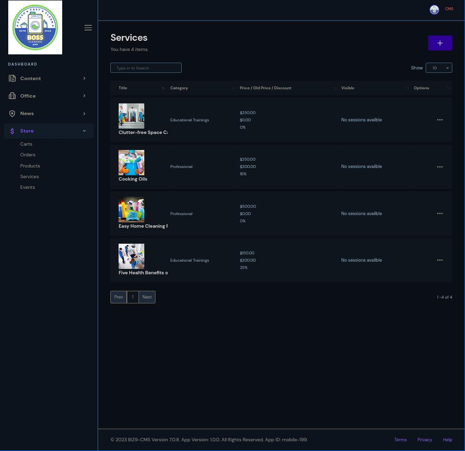
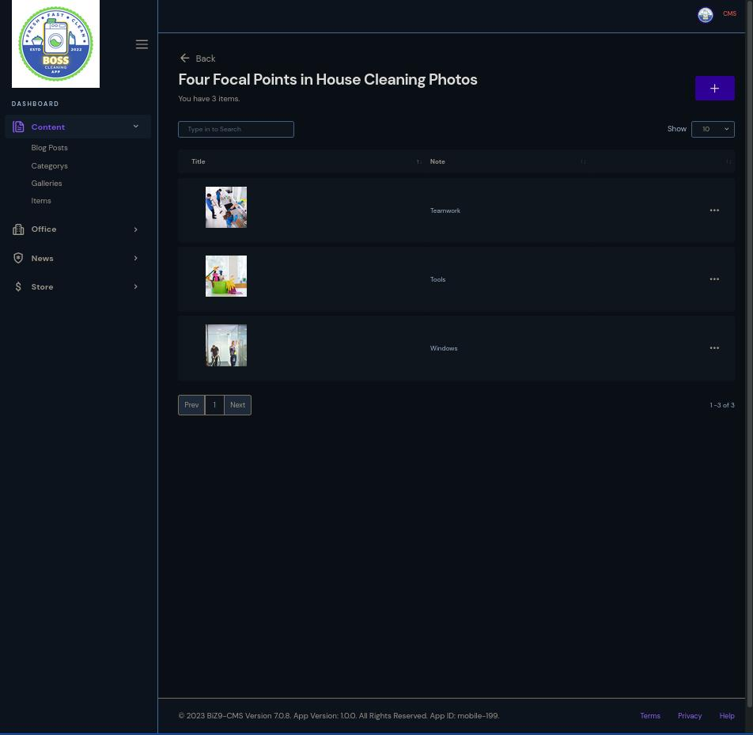

# BiZ9-CMS
 BiZ9-CMS is a free and open-source content management system (CMS) for publishing application content. This CMS is equipped to process orders, handle service booking, modify events, and even add blog posts. The CMS is fully customizable and can be modified to fit the applications needs. 

# Screen ShotZ

## About

### The Core of The BiZ9 Framework
The BiZ9-Core library is the heart of the BiZ9 Framework. It is used within a Node.js application as an interface to handle popular business functions such as product processing, service booking, and ticket handling. You access the core library interface with pre defined data about the project, database settings, and 3rd party tool parameters. The data access utilizes memory caching to speed things up.

#### Required Libriaries
* [MongoDB](https://www.mongodb.com/)
* [Redis](https://redis.io/)
#### Other Libriaries
* [Amazon Web Service SDK](https://aws.amazon.com/developer/tools/)
* [Stripe](https://stripe.com/docs/api)
* [Brevo API](https://developers.brevo.com/)

### Fast Data Access
The core library handles data access for applications as well. Data is retrieved from cache instead of the database. This speeds up data processing tremendously. On data insert, each object is written to the database, and also added to memory using a unique key/value. To retrieve data, you would use that unique key and the object will be accessed via the system memory instead of the database. This approach speeds up data access of the application.

### Key Features
* CRUD Data Access
* Caching
* Business Logic
* Utilities
* Notifications
* File Processing
* Cloud Storage

## E-mail
- certifiedcoderz@gmail.com
## Code
- [BiZ9 Framework Github](https://github.com/biz9framework)
- [BiZ9 Core NPM](https://www.npmjs.com/package/biz9-core)
## Website
- [certifiedcoderz.com](https://certifiedcoderz.com)
## Support
- [$TaNK9Code](https://cash.app/$Tank9Code)

## The BiZ9 Framework 🦾

The BiZ9 Framework is a user-friendly platform for building fast and scalable network applications. The framework consists of libraries and software tools like: Node,js, ExpressJS, MongoDB, Nginx, Redis, GIT, and Bash. The BIZ9 Framework is designed to build, maintain, and deploy rich, robust, and data driven real-time applications for data driven web, Android and Apple devices. Other 3rd party Application Programming Interfaces that are pre included are Amazon Web Service, Stripe and Bravely.

- [What Is The BiZ9 Framework? ](https://medium.com/@tank9code/what-is-the-biz9-framework-ec67d123e505)
- [BoSS Mobile App Youtube Demo](https://youtu.be/W_ZUmwZMFoc?si=4b5_6q9vPgi1IxPL)

## TaNK9 Code 👽

Brandon Poole Sr also known as ‘TaNK’ is a full stack technical lead and application developer with 17 years of experience. He was born and raised in Atlanta, Ga and graduated with a Computer Information Systems degree from Fort Valley State University (FVSU). He is proficient in ASP.NET C#, ASP.NET MVC, .NET Core, Microsoft SQL Server, IIS Web Server, Node.js, Framework7, Redis, Amazon Web Services, Apple IOS, Android SDK, Redis, NGINX, GIT.
- [Tank9Code Blog](https://medium.com/@tank9code/about-brandon-poole-sr-ac2fe8e06a09)
- [9_OPZ Certified CoderZ Founder](https://certifiedcoderz.com)
- [BoSS AppZ Creator](https://bossappz.com)
- The Real Tank from the Matrix movie!

## LinkZ:
- [certifiedcoderz.com](certifiedcoderz.com)
- [instagram.com/tank9code](instagram.com/tank9code)
- [twitch.com/tank9code](twitch.com/tank9code)
- [twitter.com/tank9code](twitter.com/tank9code)
- [medium.com/@tank9code](medium.com/@tank9code)
- [blogpost.com/certifiedcoderz](blogpost.com/certifiedcoderz)
- [blogpost.com/tank9code](blogpost.com/tank9code)
- [tictok.com/tank9code](tictok.com/tank9code)
- [facebook.com/tank9code](facebook.com/tank9code)
## TagZ:
#### #BoSSAppZ
#### #BiZ9Framework
#### #EBook
#### #Mobile
#### #Apple
#### #Android
#### #IOS
#### #Linux
#### #AmazonWebServices
#### #AppMoneyNoteZ
#### #TaNKCode9
#### Thank you for your time.
####  Looking forward to working with you.

