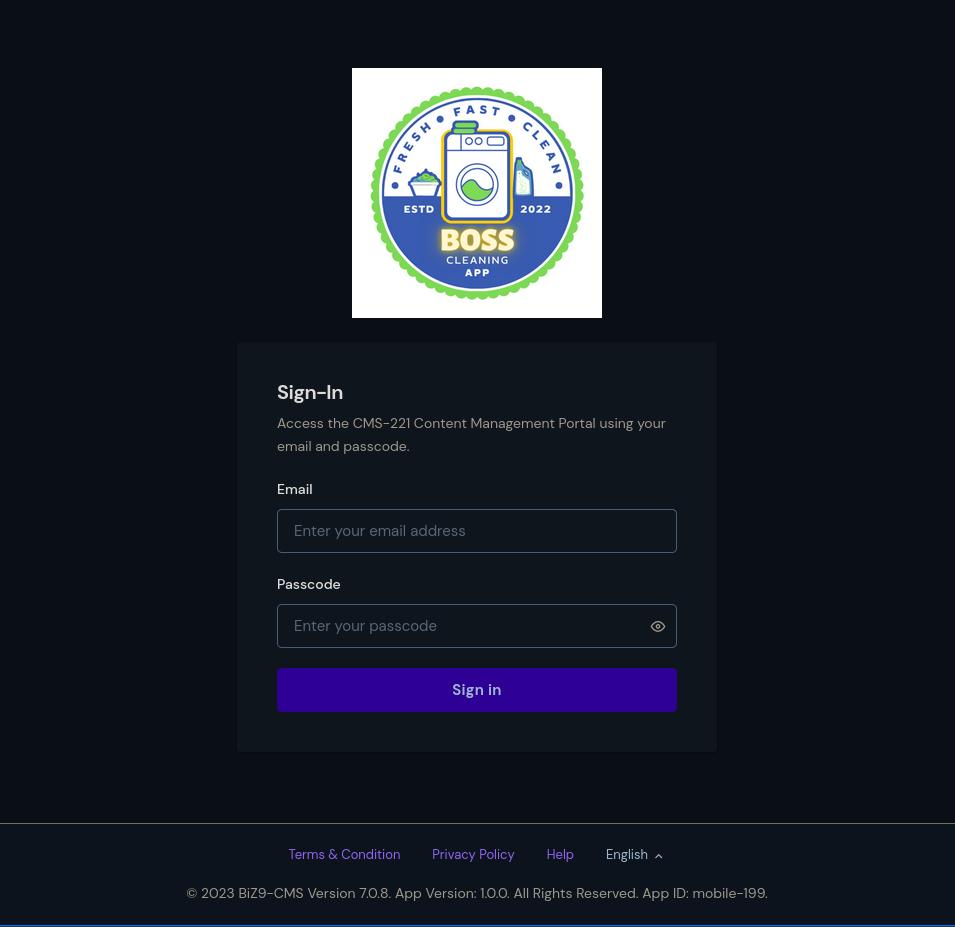
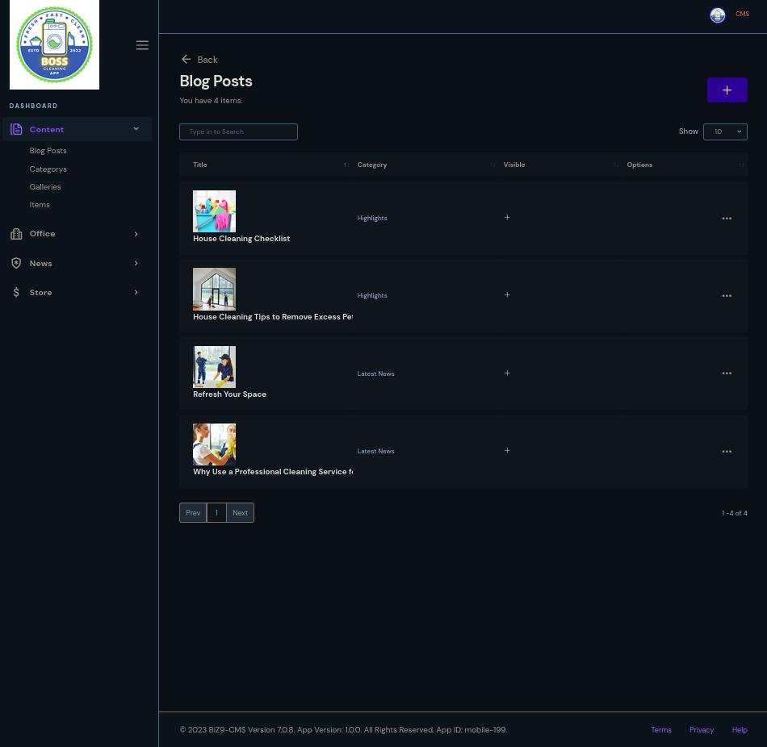
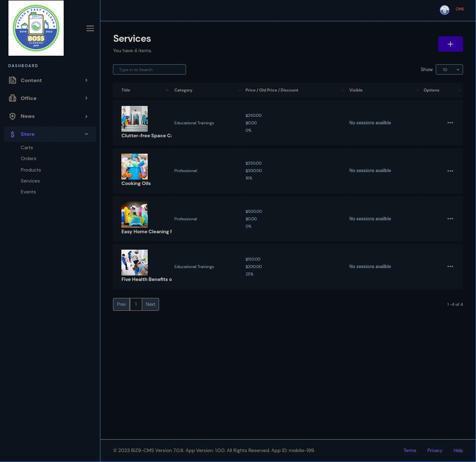
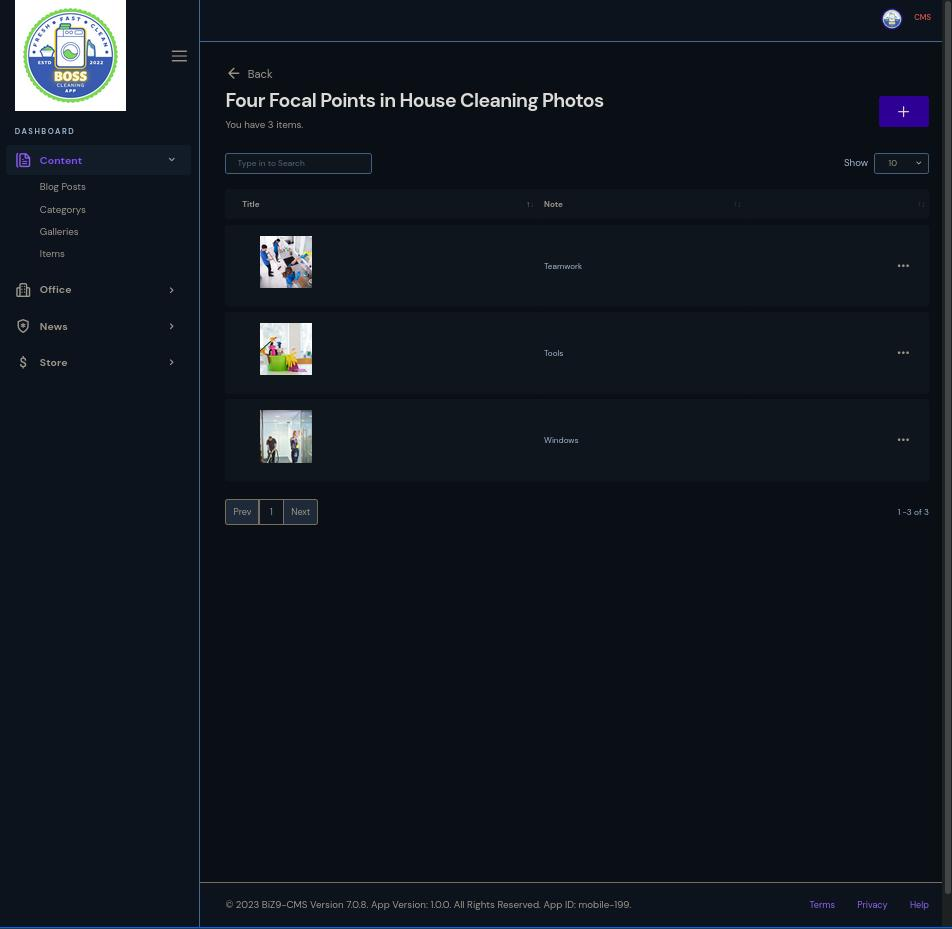
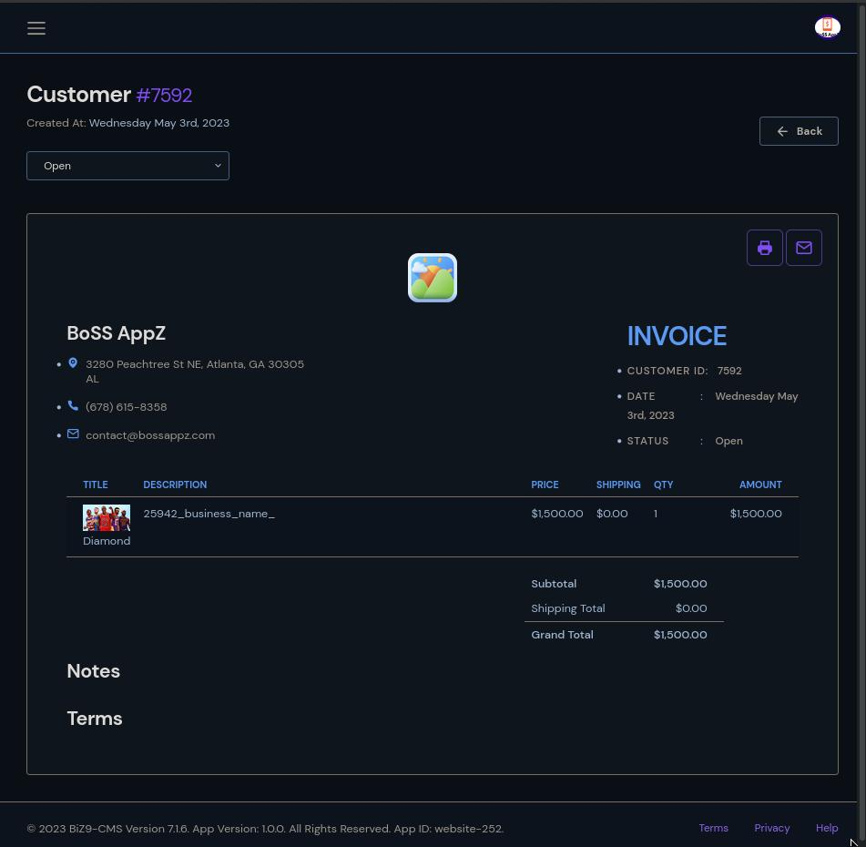
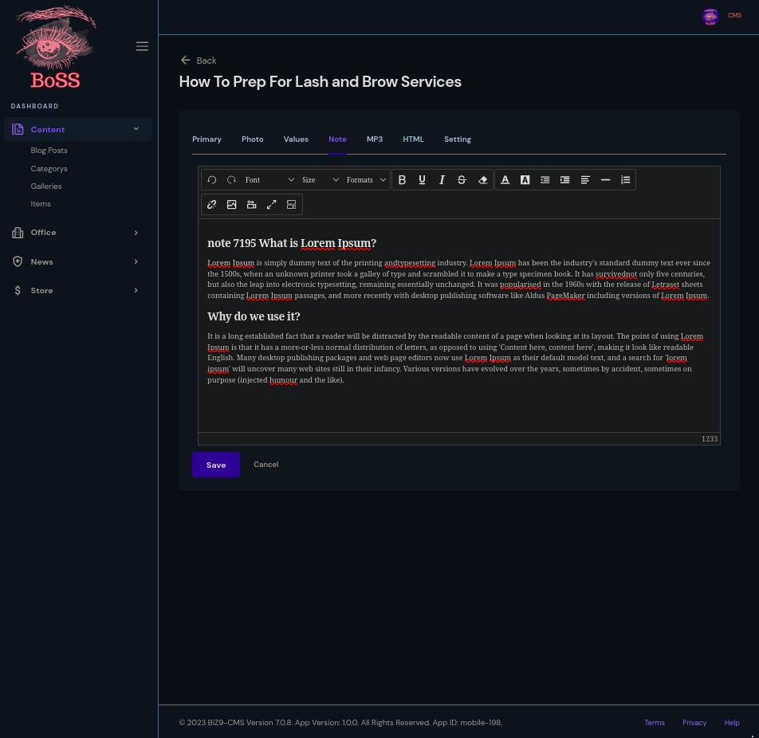

# BiZ9-CMS

## Overview
The BiZ9-CMS Content management (CMS) is a software system that helps users create, manage, and modify content on a website without the need for technical knowledge. The BiZ9-CMS compares to other CMS systems such as WordPress, Drupal, Wix, and Squarespace. Using a CMS is best because it will organize your content and make it easily available to customers. 

### Primary features included are:

- Product, Service, Order, Event, Gallery, Customer, Blog Post, and Team processing.
- Admin and user rights.
- Application content parent and child nesting.
- Product, Service, Order, Event, Gallery, - Customer, Blog Post, and Team processing.
- Admin and user rights.
- Application content parent and child nesting.

### ScreenShotZ

## Company
- BoSS AppZ

## Code
- [BiZ9 Framework Github](https://github.com/biz9framework)
- [BiZ9 Core NPM](https://www.npmjs.com/package/biz9-core)

## E-mail
- contact@bossappz.com

## Website
- [bossappz.com](https://bossappz.com)
- [mobile.bossappz.com](https://mobile.bossappz.com)

## BoSS AppZ 💰
BoSS AppZ are web and mobile applications built for the BoSS on the go. The primary features of the BoSS AppZ are ThemeForest.net, The BiZ9 Framework, and Amazon Web Services. BoSS ApZZ powers many applications in the healthcare, retail and manufacturing industries.
- [Blog](https://bossappz.medium.com)

## App Money NoteZ 💯
Application Development NoteZ That Make $ense! Cuts out all the blah, blah, blah and gets right to the resultZ!

## The BiZ9 Framework 🦾
The BiZ9 Framework is a user-friendly platform for building fast and scalable network applications. The framework consists of libraries and software tools like: Node,js, React Native, Angular, ExpressJS, MongoDB, Nginx, Redis, GIT, and Bash scripts. The BIZ9 Framework is designed to build, maintain, and deploy rich and robust, applications for web, Android and Apple devices. Other 3rd party  Application Programming Interfaces included are Amazon Web Service, Stripe, and Bravely.
- [Website](https://github.com/biz9framework)
- [Blog](https://bossappz.medium.com/what-is-the-biz9-framework-29731c49ad79)

## BoSS AppZ Developer  ClaZZ💡
The BoSS AppZ Application Development Class is custom designed for each individual that desires to learn the art of application development for career or self-use purposes. We will teach you and train you on how to become a full stack application developer. Mobile applications are the future. Stay informed with the best and greatest tools for application development. 
- [Website](https://bossappz.com/clazz)

## TaNK9 Code 👽
Brandon Poole Sr also known as ‘TaNK’ is a full stack application developer 
born and raised in Atlanta Ga and graduated with a Computer Information Systems degree from Fort Valley State University (FVSU).  While attending FVSU Mr. Poole created a social network titled CrunkFriends. It accumulated over 50k registered members and was the first of its kind back in 2005.

Mr. Poole went on to have a career as a Senior Application Developer for many premium Technology companies. The names of those tech companies are Colonial Pipeline, Nascar, Home Depot, the Center for Disease Control, American Cancer Society,  and the United Parcel Service. 

He is sometimes referred to as “the real Tank” from the movie The Matrix.

- [Website](https://certifiedcoderz.com)
- [Blog](https://medium.com/@tank9code/about-brandon-poole-sr-ac2fe8e06a09)
- [Email](mailto:certifiedcoderz@gmail.com)

## Brandon Poole Sr.
- BoSS AppZ Creator
- 9_OPZ #Certified CoderZ Founder
- The Real Tank from the #Matrix movie! 
- Expert in Open Source Software

## LinkZ:
- [bossappz.com](bossappz.com)
- [medium.com/bossappz](medium.com/bossappz)
- [bossappz.blogspot.com](https://bossappz.blogspot.com)
- [twitter.com/boss_appz](https:twitter.com/boss_appz)
- [youtube.com/boss_appz](https://www.youtube.com/@bossappzclazz/videos)
- [instagram.com/bossappz_showcase](instagram.com/bossappz_showcase)
- [facebook.com/bossappz](facebook.com/bossappz)

## TagZ:
#### #BoSSAppZ
#### #BiZ9Framework
#### #EBook
#### #Mobile
#### #Apple
#### #Android
#### #IOS
#### #Linux
#### #AmazonWebServices
#### #AppMoneyNoteZ
#### #TaNKCode9
#### Thank you for your time.
####  Looking forward to working with you.

